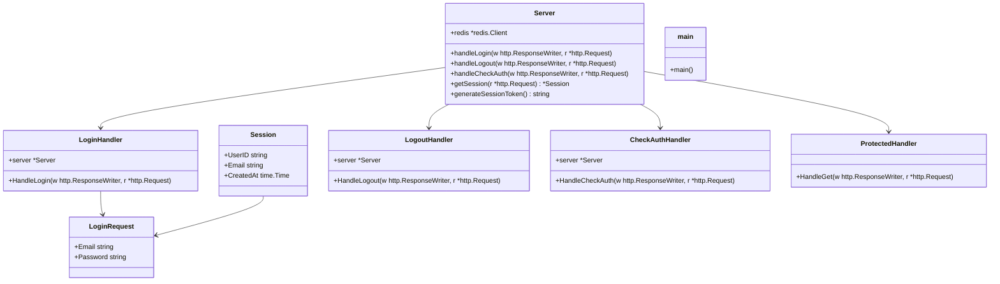
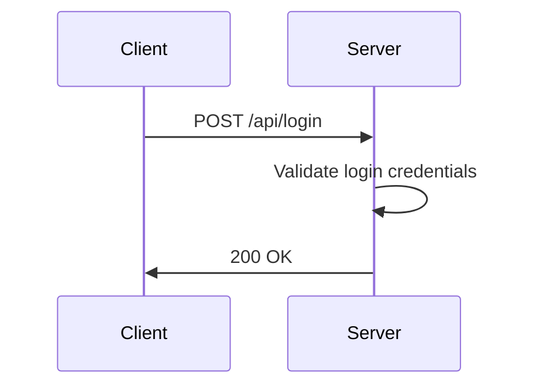
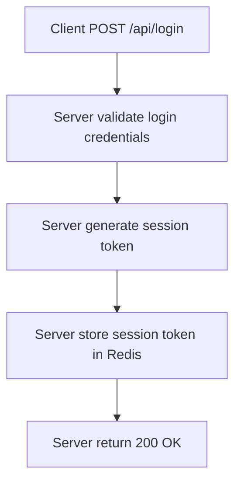
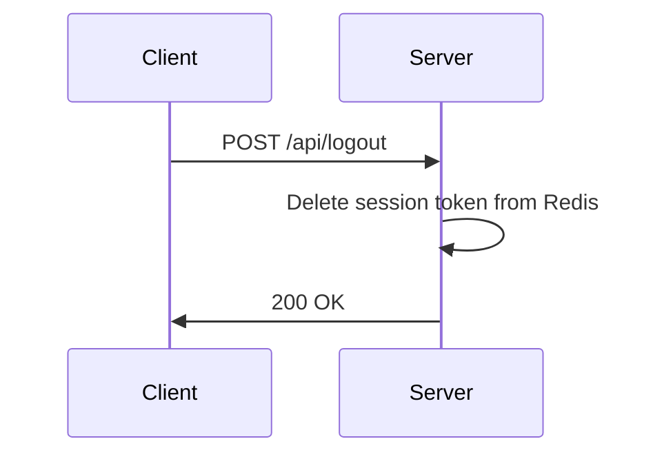
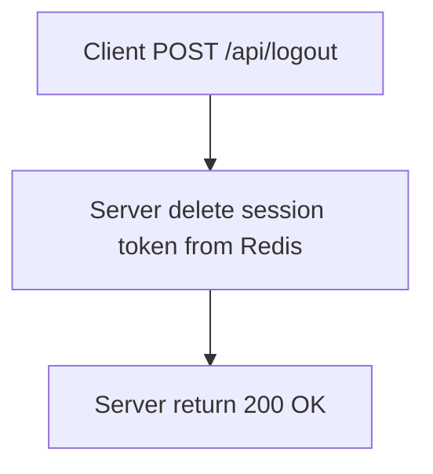
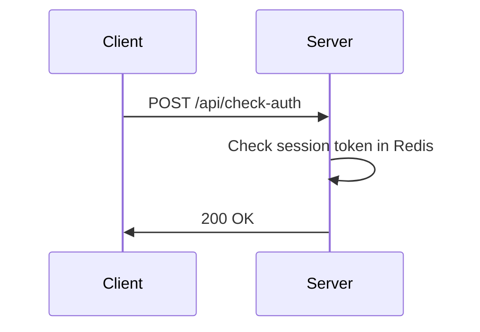
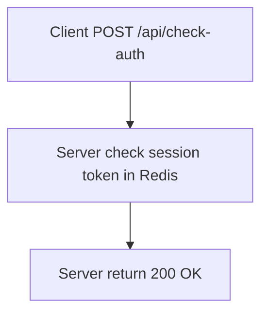

# Session Management

## Overview
Session management is a crucial part of any web application. It is used to manage user sessions, authenticate users, and manage user sessions.

## Setup
### Backend
```bash
go mod tidy
```
Run the server
```bash
go run cmd/server.go
```
### Frontend
```bash
cd front
npm install
```
Run the frontend server
```bash
npm run dev
```

## Folder Structure

```
session-management/
├── auth/
│   ├── auth.go
│   ├── auth_test.go
├── cmd/
│   ├── server.go
```

## Class Diagram




## 1. Login
### Api Flow

### Redis Flow

### Redis Commands
```bash
HSET session:<session_token> user_id <user_id> email <email> created_at <created_at>
```

### Go Code
```go
func (s *Server) handleLogin(w http.ResponseWriter, r *http.Request) {
	var loginReq LoginRequest
	if err := json.NewDecoder(r.Body).Decode(&loginReq); err != nil {
		http.Error(w, "Invalid request", http.StatusBadRequest)
		return
	}

	// Hash the password for the mock user
	storedHash, err := bcrypt.GenerateFromPassword([]byte("password123"), bcrypt.DefaultCost)
	if err != nil {
		http.Error(w, "Server error", http.StatusInternalServerError)
		return
	}

	mockUser := &Session{
		UserID:    "1",
		Email:     "test@example.com",
		CreatedAt: time.Now(),
	}

	// Verify password
	if err := bcrypt.CompareHashAndPassword(storedHash, []byte(loginReq.Password)); err != nil {
		http.Error(w, "Invalid credentials", http.StatusUnauthorized)
		return
	}

	fmt.Println("Login successful")
	// Generate session token
	sessionToken, err := s.generateSessionToken()
	if err != nil {
		http.Error(w, "Server error", http.StatusInternalServerError)
		return
	}
	fmt.Println("Session token:", sessionToken)

	// Create session
	sessionJSON, _ := json.Marshal(mockUser)
	err = s.redis.Set(r.Context(), "session:"+sessionToken, sessionJSON, 24*time.Hour).Err()
	if err != nil {
		http.Error(w, "Server error", http.StatusInternalServerError)
		return
	}

	// Respond with session token
	w.Header().Set("Content-Type", "application/json")
	json.NewEncoder(w).Encode(map[string]string{
		"session_token": sessionToken,
		"message":       "Login successful",
	})
}
```

## 2. Logout
### Api Flow

### Redis Flow

### Redis Commands
```bash
DEL session:<session_token>
```
### Go Code
```go
func (s *Server) handleLogout(w http.ResponseWriter, r *http.Request) {
	s.redis.Del(r.Context(), "session:"+s.getSession(r).SessionToken)
	w.WriteHeader(http.StatusOK)
}
```

## 3. Check Auth
### Api Flow

### Redis Flow

### Redis Commands
```bash
HGETALL session:<session_token>
```
### Go Code
```go
func (s *Server) handleCheckAuth(w http.ResponseWriter, r *http.Request) {
	session, err := s.getSession(r)
	if err != nil {
		http.Error(w, "Unauthorized", http.StatusUnauthorized)
		return
	}
``` 

## Summary
- Session management is a crucial part of any web application. It is used to manage user sessions, authenticate users, and manage user sessions.
- Redis is used to store session tokens.
- Go is used to implement the server.
- Axios is used to make requests to the server.
- Nodejs is used to run the frontend server.