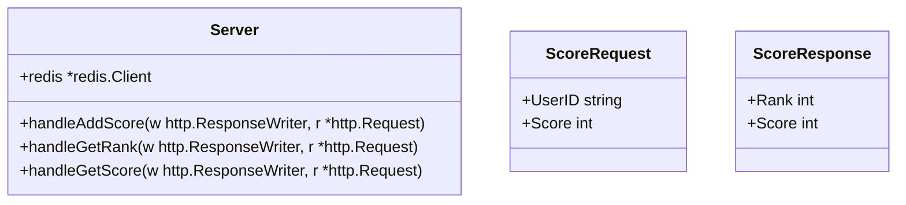
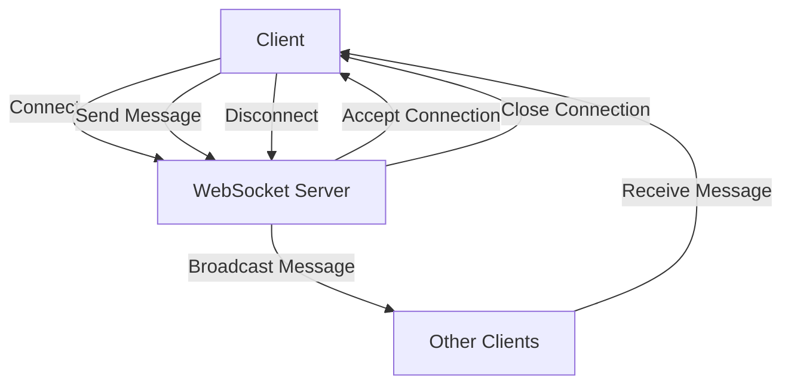

# Leaderboard

## Overview
Leaderboard is a common feature in many applications, especially in gaming and social networking. It is used to rank users based on their performance or activities.

## Setup
### Backend
```bash
go mod tidy
```
Run the server
```bash
go run cmd/server.go
```
### Frontend
```bash
cd front
npm install
```
Run the frontend server
```bash
npm run dev
```

## Folder Structure

```
leaderboard/
├── leaderboard/
│   ├── leaderboard.go
│   ├── leaderboard_test.go
├── cmd/
│   ├── server.go
```

## Class Diagram



# Leaderboard

## Overview
Leaderboard is a common feature in many applications, especially in gaming and social networking. It is used to display the top users based on a certain criteria, usually score.

## How it works
1. When a user's score changes, the server updates the user's score in the leaderboard.
2. The server uses a Redis sorted set to store the leaderboard. The score is the user's score and the member is the user's ID.
3. The server can use Redis commands like ZADD to add a user to the leaderboard, ZINCRBY to update a user's score, and ZREVRANGE to get the top users.
4. The server can also use ZRANK to get a user's rank and ZSCORE to get a user's score.

## Example
```go
func handleAddScore(w http.ResponseWriter, r *http.Request) {
    // Assume the request body is a JSON object with the user's ID and score
    var scoreRequest ScoreRequest
    err := json.NewDecoder(r.Body).Decode(&scoreRequest)
    if err != nil {
        http.Error(w, "Invalid request body", http.StatusBadRequest)
        return
    }

    // Add the user's score to the leaderboard
    err = s.redis.ZAdd(ctx, "leaderboard", &redis.Z{Score: float64(scoreRequest.Score), Member: scoreRequest.UserID}).Err()
    if err != nil {
        http.Error(w, "Error adding score to leaderboard", http.StatusInternalServerError)
        return
    }

    // After adding the score, broadcast the update
    message := fmt.Sprintf("User %s has a new score: %d", scoreRequest.UserID, scoreRequest.Score)
    broadcastMessage([]byte(message))

    w.WriteHeader(http.StatusNoContent)
}

func handleGetRank(w http.ResponseWriter, r *http.Request) {
    // Assume the request URL has a query parameter "user_id" with the user's ID
    userID := r.URL.Query().Get("user_id")

    // Get the user's rank from the leaderboard
    rank, err := s.redis.ZRevRank(ctx, "leaderboard", userID).Result()
    if err == redis.Nil {
        http.Error(w, "User not found in leaderboard", http.StatusNotFound)
        return
    } else if err != nil {
        http.Error(w, "Error getting user's rank", http.StatusInternalServerError)
        return
    }

    // Return the user's rank
    w.Header().Set("Content-Type", "application/json")
    json.NewEncoder(w).Encode(map[string]int{"rank": int(rank) + 1})
}

func handleGetScore(w http.ResponseWriter, r *http.Request) {
    // Assume the request URL has a query parameter "user_id" with the user's ID
    userID := r.URL.Query().Get("user_id")

    // Get the user's score from the leaderboard
    score, err := s.redis.ZScore(ctx, "leaderboard", userID).Result()
    if err == redis.Nil {
        http.Error(w, "User not found in leaderboard", http.StatusNotFound)
        return
    } else if err != nil {
        http.Error(w, "Error getting user's score", http.StatusInternalServerError)
        return
    }

    // Return the user's score
    w.Header().Set("Content-Type", "application/json")
    json.NewEncoder(w).Encode(map[string]int{"score": int(score)})
}
```

## Redis
In this project, Redis plays a crucial role in storing and managing player scores and rankings. The main Redis functions utilized in this project are:

*   **ZAdd**: This function is used to add a new score to the leaderboard. It takes the leaderboard name, score, and user ID as parameters. If the user ID already exists in the leaderboard, the score is updated.
*   **ZRevRank**: This function is used to retrieve the rank of a user in the leaderboard. It takes the leaderboard name and user ID as parameters and returns the rank of the user. If the user ID does not exist in the leaderboard, it returns a nil value.
*   **ZScore**: This function is used to retrieve the score of a user in the leaderboard. It takes the leaderboard name and user ID as parameters and returns the score of the user. If the user ID does not exist in the leaderboard, it returns a nil value.

These Redis functions enable the project to efficiently store and retrieve player scores and rankings, making it an essential component of the leaderboard system.


## Working with WebSockets in the Project

To establish real-time communication between the client and server, WebSockets are utilized in this project. The following flowchart illustrates the process of working with WebSockets:



In the context of the leaderboard project, WebSocket can be used to facilitate real-time updates for users, such as notifying them when their rank changes or when a new score is added. Below is a description of how to implement WebSocket functionality in both the backend and frontend of the leaderboard project, along with relevant code examples.


### Backend Implementation (Go)
In the backend, you would set up a WebSocket server to handle connections and broadcast messages to connected clients whenever a score is updated.

#### Step 1: Set Up WebSocket Server
You can modify the existing server code to include WebSocket handling. Here’s an example of how to do this:

```go
package main

import (
	"github.com/gorilla/websocket"
	"log"
	"net/http"
	"sync"
)

var upgrader = websocket.Upgrader{}
var clients = make(map[*websocket.Conn]bool)
var mu sync.Mutex

// Broadcast message to all connected clients
func broadcastMessage(message []byte) {
	mu.Lock()
	defer mu.Unlock()
	for client := range clients {
		err := client.WriteMessage(websocket.TextMessage, message)
		if err != nil {
			log.Println("Error sending message:", err)
			client.Close()
			delete(clients, client)
		}
	}
}

// WebSocket handler
func handleWebSocket(w http.ResponseWriter, r *http.Request) {
	conn, err := upgrader.Upgrade(w, r, nil)
	if err != nil {
		log.Println("Error during connection upgrade:", err)
		return
	}
	defer conn.Close()

	clients[conn] = true

	for {
		_, _, err := conn.ReadMessage()
		if err != nil {
			log.Println("Error reading message:", err)
			break
		}
	}
}

// Modify handleAddScore to broadcast score updates
func handleAddScore(w http.ResponseWriter, r *http.Request) {
	// ... existing code ...
	
	// After adding the score, broadcast the update
	message := fmt.Sprintf("User %s has a new score: %d", scoreRequest.UserID, scoreRequest.Score)
	broadcastMessage([]byte(message))

	w.WriteHeader(http.StatusNoContent)
}
```

### Frontend Implementation (JavaScript)

On the frontend, you would establish a WebSocket connection to the server and listen for messages to update the UI in real-time.

#### Step 2: Connect to WebSocket and Handle Messages

Here’s how you can implement the WebSocket client in your frontend code:

```javascript
const socket = new WebSocket('ws://yourserver.com/socket');

socket.onopen = function(event) {
	console.log('WebSocket is connected.');
};

socket.onmessage = function(event) {
	console.log('Message from server:', event.data);
	// Update the leaderboard UI with the new score information
	updateLeaderboard(event.data);
};

socket.onclose = function(event) {
	console.log('WebSocket is closed now.');
};

// Function to update the leaderboard UI
function updateLeaderboard(message) {
	// Parse the message and update the UI accordingly
	const data = JSON.parse(message);
	// Example: Update the score display for the user
	// This part will depend on your specific UI implementation
}

// Sending a message to the server (if needed)
function sendMessage(message) {
	socket.send(message);
}
```

### Summary

In this leaderboard project, the WebSocket implementation allows for real-time communication between the server and clients. When a user's score is updated, the server broadcasts a message to all connected clients, which can then update their UI accordingly. This enhances the user experience by providing immediate feedback on score changes and rankings.
