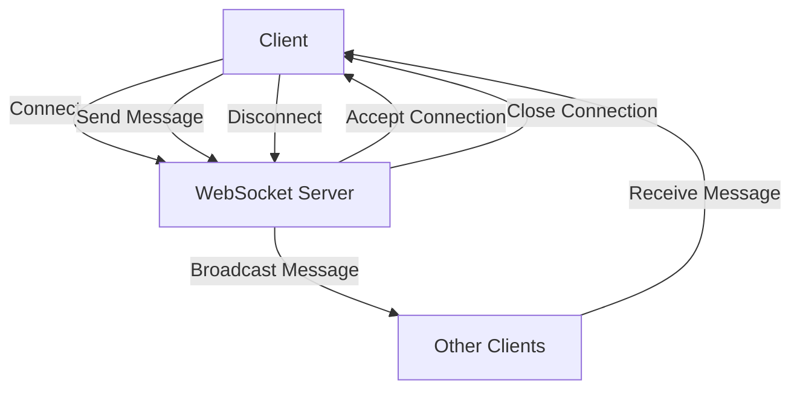

# Sales Analytics

## Overview
Sales analytics is a critical component in any e-commerce or sales-oriented application. It is used to analyze sales data, track customer behavior, and provide insights to improve sales strategies.

## How it works
1. When a sale is made, the server updates the sales data in the analytics system.
2. The server uses a Redis hash to store sales data. The hash key is the product ID, and the hash fields are the sales metrics such as quantity sold, revenue, and date.
3. The server can use Redis commands like HSET to add a new sale to the analytics system, HINCRBY to update sales metrics, and HGETALL to get all sales data for a product.
4. The server can also use Redis pipelines to batch process sales data for better performance.

## Example
```go
func handleAddSale(w http.ResponseWriter, r *http.Request) {
    // Assume the request body is a JSON object with the product ID and sales metrics
    var saleRequest SaleRequest
    err := json.NewDecoder(r.Body).Decode(&saleRequest)
    if err != nil {
        http.Error(w, "Invalid request body", http.StatusBadRequest)
        return
    }

    // Add the sale to the analytics system
    pipeline := s.redis.Pipeline()
    pipeline.HSet("sales:analytics", "product_id", saleRequest.ProductID)
    pipeline.HIncrBy("sales:analytics", "quantity_sold", saleRequest.QuantitySold)
    pipeline.HIncrBy("sales:analytics", "revenue", saleRequest.Revenue)
    _, err = pipeline.Exec()
    if err != nil {
        http.Error(w, "Error adding sale to analytics", http.StatusInternalServerError)
        return
    }

    // After adding the sale, broadcast the update
    message := fmt.Sprintf("Sale added for product %s: quantity sold %d, revenue %d", saleRequest.ProductID, saleRequest.QuantitySold, saleRequest.Revenue)
    broadcastMessage([]byte(message))

    w.WriteHeader(http.StatusNoContent)
}

func handleGetSalesData(w http.ResponseWriter, r *http.Request) {
    // Assume the request URL has a query parameter "product_id" with the product ID
    productID := r.URL.Query().Get("product_id")

    // Get the sales data for the product
    result, err := s.redis.HGetAll("sales:analytics", productID).Result()
    if err == redis.Nil {
        http.Error(w, "Product not found in sales analytics", http.StatusNotFound)
        return
    } else if err != nil {
        http.Error(w, "Error getting sales data", http.StatusInternalServerError)
        return
    }

    // Return the sales data
    w.Header().Set("Content-Type", "application/json")
    json.NewEncoder(w).Encode(result)
}
```

## Redis
In this project, Redis plays a crucial role in storing and managing sales data. The main Redis functions utilized in this project are:

*   **HSET**: This function is used to add a new sale to the analytics system. It takes the analytics key, product ID, and sales metrics as parameters. If the product ID already exists in the analytics system, the sales metrics are updated.
*   **HINCRBY**: This function is used to update sales metrics for a product. It takes the analytics key, product ID, and the increment value for the sales metric as parameters.
*   **HGETALL**: This function is used to retrieve all sales data for a product. It takes the analytics key and product ID as parameters and returns all sales metrics for the product. If the product ID does not exist in the analytics system, it returns a nil value.

These Redis functions enable the project to efficiently store and retrieve sales data, making it an essential component of the sales analytics system.


## Working with WebSockets in the Project

To establish real-time communication between the client and server, WebSockets are utilized in this project. The following flowchart illustrates the process of working with WebSockets:



In the context of the sales analytics project, WebSocket can be used to facilitate real-time updates for users, such as notifying them when a new sale is added or when sales metrics change. Below is a description of how to implement WebSocket functionality in both the backend and frontend of the sales analytics project, along with relevant code examples.


### Backend Implementation (Go)
In the backend, you would set up a WebSocket server to handle connections and broadcast messages to connected clients whenever a sale is updated.

#### Step 1: Set Up WebSocket Server
You can modify the existing server code to include WebSocket handling. Here’s an example of how to do this:

```go
package main

import (
	"github.com/gorilla/websocket"
	"log"
	"net/http"
	"sync"
)

var upgrader = websocket.Upgrader{}
var clients = make(map[*websocket.Conn]bool)
var mu sync.Mutex

// Broadcast message to all connected clients
func broadcastMessage(message []byte) {
	mu.Lock()
	defer mu.Unlock()
	for client := range clients {
		err := client.WriteMessage(websocket.TextMessage, message)
		if err != nil {
			log.Println("Error sending message:", err)
			client.Close()
			delete(clients, client)
		}
	}
}

// WebSocket handler
func handleWebSocket(w http.ResponseWriter, r *http.Request) {
	conn, err := upgrader.Upgrade(w, r, nil)
	if err != nil {
		log.Println("Error during connection upgrade:", err)
		return
	}
	defer conn.Close()

	clients[conn] = true

	for {
		_, _, err := conn.ReadMessage()
		if err != nil {
			log.Println("Error reading message:", err)
			break
		}
	}
}

// Modify handleAddSale to broadcast sales updates
func handleAddSale(w http.ResponseWriter, r *http.Request) {
	// ... existing code ...
	
	// After adding the sale, broadcast the update
	message := fmt.Sprintf("Sale added for product %s: quantity sold %d, revenue %d", saleRequest.ProductID, saleRequest.QuantitySold, saleRequest.Revenue)
	broadcastMessage([]byte(message))

	w.WriteHeader(http.StatusNoContent)
}
```

### Frontend Implementation (JavaScript)

On the frontend, you would establish a WebSocket connection to the server and listen for messages to update the UI in real-time.

#### Step 2: Connect to WebSocket and Handle Messages

Here’s how you can implement the WebSocket client in your frontend code:

```javascript
const socket = new WebSocket('ws://yourserver.com/socket');

socket.onopen = function(event) {
	console.log('WebSocket is connected.');
};

socket.onmessage = function(event) {
	console.log('Message from server:', event.data);
	// Update the sales analytics UI with the new sales data
	updateSalesAnalytics(event.data);
};

socket.onclose = function(event) {
	console.log('WebSocket is closed now.');
};

// Function to update the sales analytics UI
function updateSalesAnalytics(message) {
	// Parse the message and update the UI accordingly
	const data = JSON.parse(message);
	// Example: Update the sales metrics display for the product
	// This part will depend on your specific UI implementation
}

// Sending a message to the server (if needed)
function sendMessage(message) {
	socket.send(message);
}
```

### Summary

In this sales analytics project, the WebSocket implementation allows for real-time communication between the server and clients. When a new sale is added, the server broadcasts a message to all connected clients, which can then update their UI accordingly. This enhances the user experience by providing immediate feedback on sales metrics and trends.

