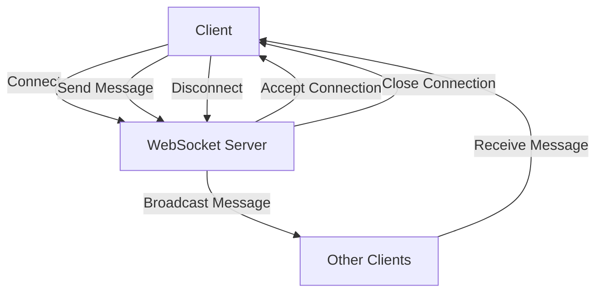

# Lucky Draw

## Overview
Lucky draw is a feature commonly found in applications that offer rewards or prizes to users. It is used to randomly select winners based on a set of criteria.

## How it works
1. When a user enters the lucky draw, the server adds the user's entry to the draw pool.
2. The server uses a Redis set to store the draw pool. The set members are the user IDs.
3. The server can use Redis commands like SADD to add a user to the draw pool, SRANDMEMBER to randomly select a winner, and SREM to remove the winner from the pool.
4. The server can also use Redis transactions to ensure atomicity when selecting and removing the winner.

## Example
```go
func handleEnterDraw(w http.ResponseWriter, r *http.Request) {
    // Assume the request body is a JSON object with the user's ID
    var drawRequest DrawRequest
    err := json.NewDecoder(r.Body).Decode(&drawRequest)
    if err != nil {
        http.Error(w, "Invalid request body", http.StatusBadRequest)
        return
    }

    // Add the user to the draw pool
    err = s.redis.SAdd("draw:pool", drawRequest.UserID).Err()
    if err != nil {
        http.Error(w, "Error adding user to draw pool", http.StatusInternalServerError)
        return
    }

    // After adding the user, broadcast the update
    message := fmt.Sprintf("User %s has entered the lucky draw", drawRequest.UserID)
    broadcastMessage([]byte(message))

    w.WriteHeader(http.StatusNoContent)
}

func handleSelectWinner(w http.ResponseWriter, r *http.Request) {
    // Select a random winner from the draw pool
    winner, err := s.redis.SRandMember("draw:pool").Result()
    if err == redis.Nil {
        http.Error(w, "No users in the draw pool", http.StatusNotFound)
        return
    } else if err != nil {
        http.Error(w, "Error selecting winner", http.StatusInternalServerError)
        return
    }

    // Remove the winner from the draw pool
    err = s.redis.SRem("draw:pool", winner).Err()
    if err != nil {
        http.Error(w, "Error removing winner from draw pool", http.StatusInternalServerError)
        return
    }

    // Return the winner
    w.Header().Set("Content-Type", "application/json")
    json.NewEncoder(w).Encode(map[string]string{"winner": winner})
}
```

## Redis
In this project, Redis plays a crucial role in managing the lucky draw pool and selecting winners. The main Redis functions utilized in this project are:

*   **SADD**: This function is used to add a user to the draw pool. It takes the draw pool key and user ID as parameters.
*   **SRANDMEMBER**: This function is used to randomly select a winner from the draw pool. It takes the draw pool key as a parameter and returns a random member from the set.
*   **SREM**: This function is used to remove the winner from the draw pool. It takes the draw pool key and winner's ID as parameters.

These Redis functions enable the project to efficiently manage the lucky draw pool and select winners, making it an essential component of the lucky draw system.


## Working with WebSockets in the Project

To establish real-time communication between the client and server, WebSockets are utilized in this project. The following flowchart illustrates the process of working with WebSockets:



In the context of the lucky draw project, WebSocket can be used to facilitate real-time updates for users, such as notifying them when a new user enters the draw or when a winner is selected. Below is a description of how to implement WebSocket functionality in both the backend and frontend of the lucky draw project, along with relevant code examples.


### Backend Implementation (Go)
In the backend, you would set up a WebSocket server to handle connections and broadcast messages to connected clients whenever a user enters the draw or a winner is selected.

#### Step 1: Set Up WebSocket Server
You can modify the existing server code to include WebSocket handling. Here’s an example of how to do this:

```go
package main

import (
	"github.com/gorilla/websocket"
	"log"
	"net/http"
	"sync"
)

var upgrader = websocket.Upgrader{}
var clients = make(map[*websocket.Conn]bool)
var mu sync.Mutex

// Broadcast message to all connected clients
func broadcastMessage(message []byte) {
	mu.Lock()
	defer mu.Unlock()
	for client := range clients {
		err := client.WriteMessage(websocket.TextMessage, message)
		if err != nil {
			log.Println("Error sending message:", err)
			client.Close()
			delete(clients, client)
		}
	}
}

// WebSocket handler
func handleWebSocket(w http.ResponseWriter, r *http.Request) {
	conn, err := upgrader.Upgrade(w, r, nil)
	if err != nil {
		log.Println("Error during connection upgrade:", err)
		return
	}
	defer conn.Close()

	clients[conn] = true

	for {
		_, _, err := conn.ReadMessage()
		if err != nil {
			log.Println("Error reading message:", err)
			break
		}
	}
}

// Modify handleEnterDraw to broadcast draw updates
func handleEnterDraw(w http.ResponseWriter, r *http.Request) {
	// ... existing code ...
	
	// After adding the user, broadcast the update
	message := fmt.Sprintf("User %s has entered the lucky draw", drawRequest.UserID)
	broadcastMessage([]byte(message))

	w.WriteHeader(http.StatusNoContent)
}

// Modify handleSelectWinner to broadcast winner selection
func handleSelectWinner(w http.ResponseWriter, r *http.Request) {
	// ... existing code ...
	
	// After selecting the winner, broadcast the update
	message := fmt.Sprintf("Winner selected: %s", winner)
	broadcastMessage([]byte(message))

	w.WriteHeader(http.StatusNoContent)
}
```

### Frontend Implementation (JavaScript)

On the frontend, you would establish a WebSocket connection to the server and listen for messages to update the UI in real-time.

#### Step 2: Connect to WebSocket and Handle Messages

Here’s how you can implement the WebSocket client in your frontend code:

```javascript
const socket = new WebSocket('ws://yourserver.com/socket');

socket.onopen = function(event) {
	console.log('WebSocket is connected.');
};

socket.onmessage = function(event) {
	console.log('Message from server:', event.data);
	// Update the lucky draw UI with the new draw entry or winner
	updateLuckyDraw(event.data);
};

socket.onclose = function(event) {
	console.log('WebSocket is closed now.');
};

// Function to update the lucky draw UI
function updateLuckyDraw(message) {
	// Parse the message and update the UI accordingly
	const data = JSON.parse(message);
	// Example: Update the draw entry display or announce the winner
	// This part will depend on your specific UI implementation
}

// Sending a message to the server (if needed)
function sendMessage(message) {
	socket.send(message);
}
```

### Summary

In this lucky draw project, the WebSocket implementation allows for real-time communication between the server and clients. When a user enters the draw or a winner is selected, the server broadcasts a message to all connected clients, which can then update their UI accordingly. This enhances the user experience by providing immediate feedback on draw entries and winner selection.
