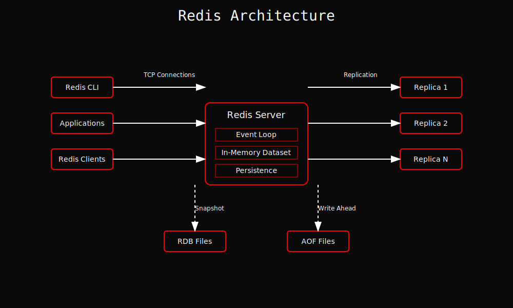

# โมดูล 1: แนะนำ Redis

## ภาพรวมของ Redis

Redis เป็นฐานข้อมูล NoSQL ที่มีความเร็วสูง ซึ่งถูกออกแบบมาเพื่อจัดการข้อมูลในหน่วยความจำ ทำให้การเข้าถึงข้อมูลเป็นไปอย่างรวดเร็วและมีประสิทธิภาพ เหมาะสำหรับการใช้งานที่ต้องการความเร็วในการประมวลผลข้อมูล เช่น การจัดการเซสชันผู้ใช้ การแคชข้อมูล และการจัดเก็บข้อมูลชั่วคราว

 <!-- แทนที่ URL นี้ด้วยลิงก์ที่ถูกต้องของภาพสถาปัตยกรรม Redis -->

ในภาพนี้ เราจะเห็นโครงสร้างพื้นฐานของ Redis ที่ประกอบด้วย Master-Slave replication, การทำงานแบบ Cluster และการจัดการข้อมูลที่มีประสิทธิภาพ ซึ่งช่วยให้ Redis สามารถรองรับการใช้งานที่มีปริมาณข้อมูลสูงได้อย่างมีประสิทธิภาพ

## คุณสมบัติและประโยชน์หลัก

- การจัดเก็บข้อมูลในหน่วยความจำ
- ความหน่วงเวลาในระดับมิลลิวินาที
- ความสามารถในการประมวลผลสูง
- สถาปัตยกรรมแบบเธรดเดียว
- การสนับสนุน Pipeline
- การดำเนินการแบบกลุ่ม

## ประเภทข้อมูล

- สตริงและตัวเลข
- รายการและชุดข้อมูล
- ชุดข้อมูลที่เรียงลำดับ (ZSET)
- แฮช
- Bitmap และ HyperLogLog
- สตรีม

## คุณสมบัติหลัก

- การทำซ้ำ
- การเก็บถาวร
- การจัดกลุ่ม
- การส่งข้อความแบบ Pub/Sub
- การเขียนสคริปต์ Lua
- ธุรกรรม

## กรณีการใช้งานทั่วไป

- การแคช
- การจัดการเซสชัน
- การวิเคราะห์แบบเรียลไทม์
- ตัวกลางข้อความ
- การจำกัดอัตรา
- กระดานผู้นำ

## ประโยชน์หลัก

- ประสิทธิภาพสูง
- ใช้งานง่าย
- โครงสร้างข้อมูลที่หลากหลาย
- ความพร้อมใช้งานสูง
- เป็นมิตรกับนักพัฒนา
- พร้อมสำหรับองค์กร