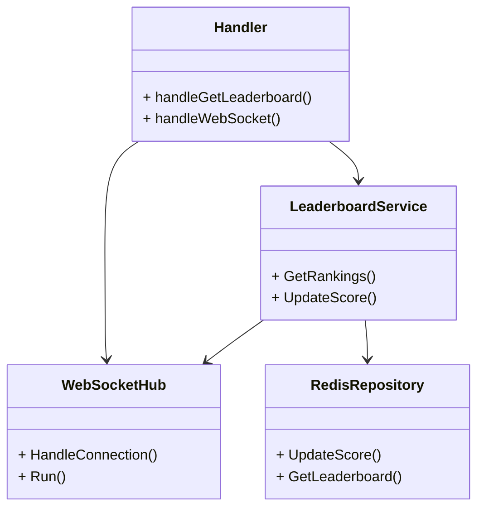

```mermaid
classDiagram
    class LeaderboardService {
        + GetRankings()
        + UpdateScore()
    }
    class WebSocketHub {
        + HandleConnection()
        + Run()
    }
    class Handler {
        + handleGetLeaderboard()
        + handleWebSocket()
    }
    class RedisRepository {
        + UpdateScore()
        + GetLeaderboard()
    }
    LeaderboardService --> WebSocketHub
    Handler --> LeaderboardService
    Handler --> WebSocketHub
    LeaderboardService --> RedisRepository

```

